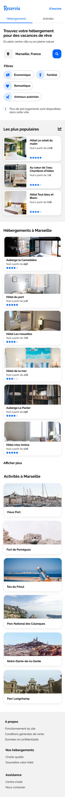

# OpenClassroom P2 : Transformez votre CV en site web

# Convention Git

* 🌌 Initialisation
* 🎱 Revert 
* 📦 Build
* 🎓 Doc
* 💎 Feature
* 🚑 Fix 
* 🚀 Optimisation
* 🦄 Refactoring
* 🌈 Style
* 🏅 Test

# Fonctionnalités

* Les usagers pourront rechercher des hébergements dans la ville de leur choix. Le champ de recherche est donc un champ de saisie, dont le texte peut être édité par l’usager. En revanche, à ce stade, le bouton de recherche ne sera pas fonctionnel.
* Chaque carte d’hébergement ou d’activité devra être cliquable dans son intégralité. Pour l’instant les liens seront vides.
* Les filtres ne seront pas fonctionnels pour cette version, en revanche, il faut qu’ils changent d’apparence au survol. Je te laisse décider de l’effet le plus approprié.
* Dans le menu, les liens “Hébergements” et “Activités” sont des ancres qui doivent mener aux sections de la page.
 
# Contraintes techniques

* Je te fournis deux maquettes : l’une desktop et l’autre mobile. Le site devra également être adapté aux tablettes. Sur ce support, tu es libre de faire les adaptations nécessaires avec la mise en page, tant qu’aucun élément n’est coupé et que le texte a une taille suffisante. Je te laisse choisir les breakpoints appropriés.
* Comme je ne savais pas de quels tailles et formats d’image tu avais besoin, j’ai exporté les images en différents formats. Je te laisse choisir le format le plus adapté par rapport à la résolution et au temps de chargement.
* Les icônes proviennent de la bibliothèque Font Awesome. Les couleurs de la charte sont le bleu #0065FC, et sa version plus claire #DEEBFF ainsi que le gris pour le fond #F2F2F2.
* La police du site est Raleway.

# Choix technologiques

* N’utilise pas de framework ou pré-compilateur CSS pour ce projet (comme SASS par exemple) : comme tu démarres, je préfère que tu montes en compétences sur HTML et CSS et que tu apprennes à coder from scratch. On aimerait tester tes compétences là-dessus !
* Je te recommande d'utiliser Visual Studio Code, plusieurs plugins pourront te simplifier la vie, par exemple Live Server ou Prettier.
* Tu peux intégrer les icônes Font Awesome en HTML ou CSS. Je te conseille fortement d’utiliser Flexbox mais tu peux aussi utiliser CSS Grid si tu veux.
* Ton code devra utiliser les balises sémantiques et ne doit contenir aucune erreur ni alerte au validateur W3C HTML et CSS.
* Le site devra être compatible avec les dernières versions de Chrome et Firefox.
* Pense à séparer le HTML et le CSS et à organiser ton dossier de rendu.
* N’oublie pas de versionner ton code avec Git, et ce dès les premières lignes de code. C’est hyper important quand on travaille en équipe. Nous on utilise GitKraken comme client Git, c'est plus sympa qu'une console, mais tu fais comme tu veux. Ensuite il faut que tu déploies la page sur GitHub Pages ou GitLab Pages comme tu préfères.

# Maquettes

## Desktop

## Mobile

